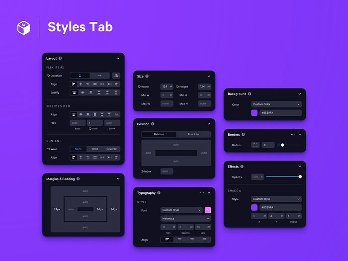

# What this?

A container for practice create on UI elements for web.

`shelves/` directory contain a collection of  
small independent components that has name  
as number value and must have linked together  
with issue on github for difficuld component for  
clear description.

## How run development server

You have easy way, just run next command in terminal

```sh
npm start
```

Another way is run for selected directory

```sh
npm run dev --dir=name_of_directory
```

### Example

Run server with content of directory name `1` with  
path `project_dir_root/shelves/1`

```sh
npm run dev --dir=1
```

## How to build

Use the same rule as in [chapter above](how-run-development-server)

```sh
npm run build --dir=name_of_directory
```

## Links

- [parceljs.org](https://parceljs.org/getting-started/webapp/)

## Gallery

<section style="display: grid; grid-template-columns: repeat( auto-fit, minmax(300px, 1fr) );gap: 15px;">
<a href="shelves/1">
    
</a>
